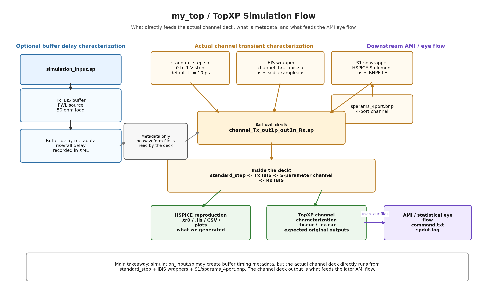

# my_top / TopXP Simulation Flow



## Short Version

`simulation_input.sp` is a buffer-only characterization deck. It does not directly feed a waveform into the actual channel transient deck.

The actual channel transient deck is:

```text
channel_Tx_out1p_out1n_Rx.sp
```

That deck directly includes or depends on:

```text
standard_step.sp
channel_Tx_out1p_out1n_Rx_ibis.sp
S1.sp
sparams_4port.bnp
scd_example.ibs
```

## Actual Channel Transient Flow

```text
standard_step.sp
        |
        v
Tx IBIS buffer
        |
        v
4-port S-parameter channel
        |
        v
Rx IBIS input buffer
        |
        v
rxnode / V(n3,n4)
```

In the deck, this appears as:

```spice
X1 n1 n2 pwr1 gnd in
+ Tx_ABC_Serdes

X2 n1 gnd n2 n3 gnd n4
+ S1_sparams_4port_bnp

X3 n3 n4 pwr2 gnd rxnode
+ Rx_ABC_Serdes

Xstim in gnd standard_step tdel = 0n
.tran 2p 30n
```

## Role Of `simulation_input.sp`

`simulation_input.sp` drives the Tx IBIS output into 50 ohm loads. It is used for Tx buffer delay characterization.

It can produce or support metadata such as:

```text
riseBufferDelay = 13.626 ps
fallBufferDelay = 2.15 ps
```

Those values appear in `channel_result.xml`, but the actual channel deck does not include a `.tr0`, `.csv`, or waveform output from `simulation_input.sp`.

## Role Of The Channel Deck Output

TopXP's later AMI/statistical flow references channel characterization files:

```text
channel_Tx_out1p_out1n_Rx_tx.cur
channel_Tx_out1p_out1n_Rx_rx.cur
```

Those are the important transient characterization outputs for the AMI flow.

In our HSPICE reproduction, we generated equivalent HSPICE artifacts:

```text
channel_hspice.tr0
channel_hspice.lis
channel_hspice_waveforms.csv
channel_hspice_waveforms.png
channel_hspice_waveforms_zoom.png
```

## Main Takeaway

The dependency relationship is:

```text
simulation_input.sp
    -> buffer timing metadata only
    -> not a direct waveform input to channel_Tx_out1p_out1n_Rx.sp

channel_Tx_out1p_out1n_Rx.sp
    -> real channel transient characterization
    -> uses IBIS + S-parameter channel + standard_step
    -> produces channel characterization waveform data

channel characterization waveform data
    -> used by downstream AMI/statistical eye flow
```
