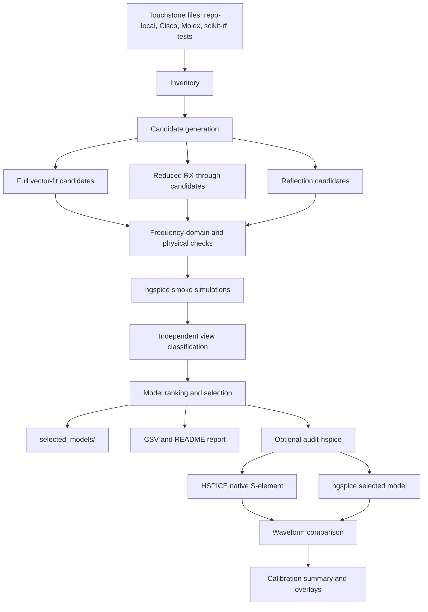
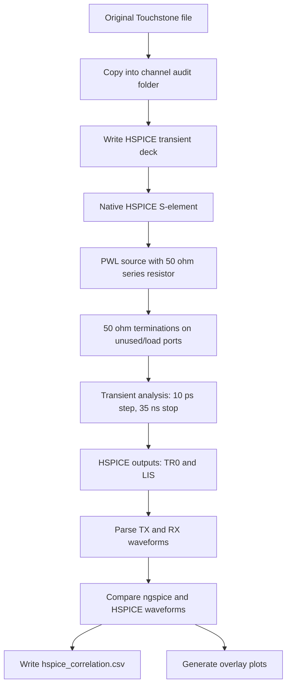
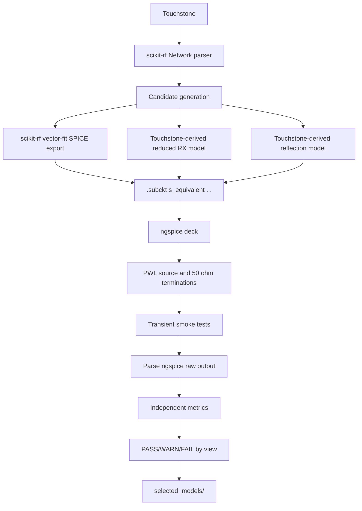
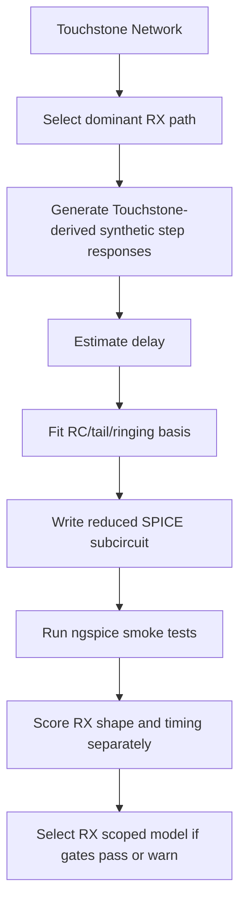

# Presentation Report: ngspice S-parameter Trust Workflow

Study folder: `results/sparam_rx_trust_v2_2026-06-11`  
Visual support: `results/visual_support_pack_2026-06-12`  
Simple one-plot overlays: `results/status_bucket_overlays_2026-06-12`

## 1. Executive Summary

### Goal

The goal is to build a reliable workflow that converts Touchstone S-parameter channels into ngspice-ready SPICE models, then tells us when those models can be trusted without using HSPICE in the normal user flow.

HSPICE is still used during development, but only as an audit reference:

- Normal flow: Touchstone -> ngspice model -> independent PASS/WARN/FAIL report.
- Development audit: compare selected ngspice model against HSPICE native S-element using the original Touchstone.
- Final target: confidence in ngspice based on independent metrics, calibrated against many HSPICE audits.

### Current Status

The current v2 calibration is conservative and useful:

- Candidate metric rows: `682`
- Channels with selected models: `149`
- Channels with no selected candidate: `56`
- HSPICE audit rows: `93`
- Successful HSPICE correlations: `80`
- Overall independent clean PASS: `0`
- Overall independent WARN: `147`
- Overall independent FAIL: `2`

The important finding is path-specific:

- RX voltage-shape PASS is currently predictive:
  - Independent RX voltage-shape PASS audited rows: `21`
  - HSPICE RX voltage-shape PASS among those: `21`
  - False PASS rate: `0.0`
- RX timing is not ready as a clean PASS:
  - Independent RX timing PASS audited rows: `9`
  - HSPICE timing PASS: `6`
  - HSPICE timing WARN: `3`
  - Timing false-PASS risk: `0.3333` if WARN is treated as not clean PASS.
- Full-model readiness is not achieved yet:
  - No reduced `.s4p` model is allowed to claim full multiport readiness.
  - Reflection/S11 behavior remains weak.

### Main Technical Conclusion

We are making real progress on RX voltage waveform shape, especially for the Cisco `.s4p` dominant through-path cases. We are not yet ready to claim general-purpose full S-parameter replacement in ngspice.

The correct story is:

- RX waveform shape: promising and now measurable.
- RX timing: often ambiguous because the RX swing is small or ringing creates unreliable 50 percent crossings.
- Reflection/TX behavior: still weak and should stay separate from RX-through readiness.
- Full model: not ready unless a full passive multiport candidate passes all gates.

## 2. Why This Problem Is Hard

S-parameters are frequency-domain multiport data. ngspice transient simulation needs a time-domain circuit/macromodel. The conversion must preserve:

- Frequency response magnitude and phase.
- Group delay.
- Passivity.
- Causality-like time behavior.
- Fast-edge transient behavior.
- Reflection and loading behavior.
- Multiport interactions.

A model can look good in frequency-domain RMS error and still fail transient edge behavior. This has been one of the central lessons from the study.

For digital channel simulation, fast edges matter. A `5 ps` edge excites much higher frequency content than a `500 ps` edge, so any high-frequency extrapolation, passivity issue, delay error, or ringing mismatch becomes visible at the edge.

## 3. Scope Of The Current Bench

The current S-parameter study bench is a fixed 50 ohm linear pulse bench. It is not an IBIS nonlinear driver bench.

### Source

The source is a PWL pulse with a 50 ohm series resistor:

```spice
Vin   src  0   PWL(0 0 1n 0 1n+edge 1.5 9n 1.5 9n+edge 0)
Rsrc  src  p1  50
.tran 10p 35n
```

Audit edge rates:

- `5 ps`
- `50 ps`
- `500 ps`

Amplitude:

- `1.5 V`

### Two-Port Connection

For `.s2p`:

```spice
p1 = driven/input side
p2 = RX/load side

Rsrc  src  p1  50
channel between p1 and p2
Rterm p2   0   50
```

Signals:

- TX comparison: `V(p1)`
- RX comparison: `V(p2)`
- Dominant RX path: `S21`

### Four-Port Connection

For `.s4p`:

```spice
p1 = driven/input port
p2 = near-side other port, terminated
p3 = RX/output port
p4 = far-side other port, terminated

Rsrc       src  p1  50
channel    p1  p2  p3  p4
Rnear_neg  p2  0   50
Rterm_pos  p3  0   50
Rterm_neg  p4  0   50
```

Signals:

- TX comparison: `V(p1)`
- RX comparison: `V(p3)`
- Dominant RX path in our current convention: `S31`

Important limitation:

- The current reduced `.s4p` model is scoped to matched 50 ohm RX-through behavior.
- It is not a full 4-port replacement.
- It should never be described as `FULL_MODEL_READY`.

## 4. Overall Workflow



The critical policy is that `qualify` does not read HSPICE results. HSPICE can only judge how predictive the independent metrics were after the model is already selected.

## 5. HSPICE Flow

### Purpose

HSPICE is the audit reference. It uses the original Touchstone directly through its native S-element. This tells us what HSPICE predicts for the same source and termination setup.

### HSPICE Flowchart



### HSPICE Deck Shape

For `.s2p`:

```spice
* HSPICE native S-parameter audit
.option post=2 probe accurate
.temp 27
Vin   src  0  PWL(...)
Rsrc  src  p1  50
Schannel  p1  p2  0  MNAME=ch_model
Rterm  p2  0  50
.MODEL ch_model S
+ TSTONEFILE='channel.s2p'
+ Z0=50
+ RATIONAL_FUNC=1
+ INTERPOLATION=HYBRID
+ LOWPASS=1
+ HIGHPASS=3
+ PASSIVE=1
.probe tran V(p1) V(p2) V(src)
.tran 10p 35n
.end
```

For `.s4p`:

```spice
* HSPICE native S-parameter audit
.option post=2 probe accurate
.temp 27
Vin   src  0  PWL(...)
Rsrc  src  p1  50
Schannel  p1  p2  p3  p4  0  MNAME=ch_model
Rnear_neg  p2  0  50
Rterm_pos  p3  0  50
Rterm_neg  p4  0  50
.MODEL ch_model S
+ TSTONEFILE='channel.s4p'
+ Z0=50
+ RATIONAL_FUNC=1
+ INTERPOLATION=HYBRID
+ LOWPASS=1
+ HIGHPASS=3
+ PASSIVE=1
.probe tran V(p1) V(p2) V(p3) V(p4) V(src)
.tran 10p 35n
.end
```

### What HSPICE Gives Us

The audit extracts:

- TX waveform error: `V(p1)` ngspice vs HSPICE.
- RX waveform error: `V(p2)` for `.s2p`, `V(p3)` for `.s4p`.
- RX active-window RMSE.
- RX active-window max absolute error.
- 50 percent crossing deltas when threshold confidence is high.
- Overshoot/undershoot and settling differences.
- PASS/WARN/FAIL audit class by view:
  - RX voltage shape.
  - RX timing.
  - Reflection/TX behavior.
  - Full-model behavior.

## 6. ngspice Flow

### Purpose

ngspice is the target simulator. The workflow converts the Touchstone channel into a SPICE subcircuit named `s_equivalent`, then simulates that subcircuit in the same 50 ohm pulse bench.

### ngspice Flowchart



### ngspice Deck Shape

For `.s2p`:

```spice
* ngspice channel smoke
.temp 27
.options method=gear maxord=2 reltol=1e-4 abstol=1e-10 vntol=1e-6 gmin=1e-12
Vin   src  0  PWL(...)
Rsrc  src  p1  50
.include 'selected_model.sp'
Xchannel  p1  p2  s_equivalent
Rterm     p2  0   50
.save V(p1) V(p2) V(src)
.tran 10p 35n
.end
```

For `.s4p`:

```spice
* ngspice channel smoke
.temp 27
.options method=gear maxord=2 reltol=1e-4 abstol=1e-10 vntol=1e-6 gmin=1e-12
Vin   src  0  PWL(...)
Rsrc  src  p1  50
.include 'selected_model.sp'
Xchannel   p1  p2  p3  p4  s_equivalent
Rnear_neg  p2  0   50
Rterm_pos  p3  0   50
Rterm_neg  p4  0   50
.save V(p1) V(p2) V(p3) V(p4) V(src)
.tran 10p 35n
.end
```

### ngspice Smoke Cases

The full smoke set includes:

- Ideal source and 50 ohm source cases.
- Edges: `5 ps`, `50 ps`, `500 ps`.
- Amplitudes: `0.05 V`, `0.1 V`, `0.5 V`, `1.5 V`.

The HSPICE audit subset currently uses:

- 50 ohm source.
- `1.5 V`.
- `5 ps`, `50 ps`, `500 ps`.
- `35 ns` stop time.

## 7. How scikit-rf Is Used

### Touchstone Parsing

scikit-rf reads each Touchstone file into a `Network` object. The workflow uses:

- `nw.frequency.f`: frequency points in Hz.
- `nw.s`: complex S-parameter matrix, shape `[frequency, output_port, input_port]`.
- `nw.z0`: reference impedance information.
- `nw.nports`: port count.

The inventory records:

- Source path.
- Port count.
- Frequency range.
- Number of points.
- Z0 summary.
- SHA-256 hash.
- Source family.
- Dominant path information.

### Vector Fitting

For full vector-fit candidates, the script creates:

```python
vf = VectorFitting(nw)
vf.auto_fit()
```

or:

```python
vf = VectorFitting(nw)
vf.vector_fit(n_poles_real=N, n_poles_cmplx=N)
```

Candidate pole grids include:

- `auto_fit`
- `vector_1r1c`
- `vector_2r2c`
- `vector_3r3c`
- `vector_4r4c`
- `vector_5r5c`
- `vector_6r6c`
- `vector_8r8c`

In the faster calibration profile:

- `.s2p`: `vector_3r3c`, `vector_5r5c`, and reduced `.s2p` candidates.
- `.s4p`: reduced `.s4p` candidates.

### Passivity And Dense Sweep

For vector-fit models, the workflow checks:

- `vf.is_passive()`
- passivity violation bands
- max singular value at input samples
- dense max singular value from DC to `high_fmax`

Default dense settings:

- `--high-fmax 400e9`
- `--dense-samples 1001` normally
- current calibration command used `--dense-samples 501`
- hard max singular value threshold: `1.05`
- passivity warning singular value threshold: `1.0`

Near-pass candidates may be passivity enforced:

```python
vf.passivity_enforce(n_samples=2000, f_max=high_fmax, preserve_dc=True)
```

### scikit-rf SPICE Export

Full vector-fit candidates are exported with:

```python
vf.write_spice_subcircuit_s(path, fitted_model_name="s_equivalent")
```

That produces a SPICE subcircuit like:

```spice
* EQUIVALENT CIRCUIT FOR VECTOR FITTED S-MATRIX
* Created using scikit-rf vectorFitting.py
.SUBCKT s_equivalent p1 p2

* Port network for port 1
V1 p1 s1 0
R1 s1 0 50.0
Gd1_1 0 s1 p1 0 ...
Fd1_1 0 s1 V1 ...
Gr1_re_1_1 0 s1 x1_re_a1 0 ...

* State networks driven by port 1
Cx1_re_a1 x1_re_a1 0 1.0
Gx1_re_a1 0 x1_re_a1 p1 0 ...
Fx1_re_a1 0 x1_re_a1 V1 ...
Rp1_re_re_a1 0 x1_re_a1 ...

* Port network for port 2
V2 p2 s2 0
R2 s2 0 50.0
...
.ENDS s_equivalent
```

Interpretation:

- Each port gets a 50 ohm reference port network.
- Controlled sources represent the rational fitted S-matrix.
- Internal state nodes represent fitted poles.
- Capacitors and controlled sources implement the dynamic response.

This is the only model family that can eventually claim `general_multiport`, if it passes the gates.

## 8. Touchstone-Derived Reduced Models

Clarification:

- The reduced models still use scikit-rf to read the Touchstone file into a `Network` object.
- They do not use scikit-rf `VectorFitting`.
- They do not use scikit-rf `write_spice_subcircuit_s`.
- The actual reduced-model fitting and SPICE generation are custom code in this repo.

### Why Reduced Models Were Added

Full vector fitting is mathematically attractive, but in this study it can fail fast-edge transient behavior even when frequency-domain error looks acceptable.

The reduced models were added to attack the most important first use case:

- matched 50 ohm digital transient RX behavior
- dominant through path
- `.s2p`: `S21`
- `.s4p`: `S31`

### Reduced RX Flowchart



### Synthetic Time-Domain Reference

For reduced fitting, the script computes a Touchstone-derived time-domain response:

1. Generate a source waveform.
2. Use a 0.5 scale factor for incident voltage into a 50 ohm source/load environment.
3. Interpolate the selected S-parameter path onto FFT frequency bins.
4. Add DC extrapolation from the first point.
5. Taper the response near the highest available Touchstone frequency.
6. Multiply source spectrum by S-parameter response.
7. IFFT back to time domain.

This creates a Touchstone-only reference for the RX step response before HSPICE is involved.

### Delay Estimation

The reduced delay estimate combines several independent estimates:

- step threshold delay
- impulse/slope peak delay
- group-delay median

For delay-equalized models, the delay estimate is the median of finite valid estimates. The reduced model then:

1. removes the bulk delay from the fitting problem,
2. fits the residual shape,
3. reinserts the delay explicitly in SPICE.

### Reduced SPICE Model Shape

A representative reduced `.s4p` model looks like:

```spice
* Touchstone-only reduced S-parameter macromodel
* Scope: matched 50 ohm transient channel qualification, not arbitrary termination replacement.
.subckt s_equivalent p1 p2 p3 p4
Tdelay p1 0 ndelay 0 Z0=50 TD=20.5445108813n
Rdelay_term ndelay 0 50
Rleak_p2 p2 0 1e12
Rleak_p4 p4 0 1e12
Rsum sum 0 1

Ebrsrc1 brsrc1 0 ndelay 0 1
Rbr1 brsrc1 br1 1000
Cbr1 br1 0 3e-14
Gsum1 0 sum br1 0 ...

Etailfsrc1 tailfsrc1 0 ndelay 0 1
Rtailf1 tailfsrc1 tailf1 1000
Ctailf1 tailf1 0 5e-14
Gtailf1 0 sum tailf1 0 ...

Eout outdrv 0 sum 0 2
Rout outdrv p3 50
.ends s_equivalent
```

Interpretation:

- `Tdelay` supplies the dominant transport delay.
- RC basis branches model the smoothed through response.
- Tail branches model slower settling behavior.
- Ring branches, when used, model fast edge feedthrough/ringing shape.
- `Eout` and `Rout` drive the RX output port.
- Unused ports are weakly tied with large leak resistors.

Scope warning:

- This model is intentionally reduced.
- It is designed for matched 50 ohm RX-through simulation.
- It does not preserve the full 4-port S-matrix.

## 9. Reflection Model Status

Reflection is handled separately because improving RX-through behavior and improving S11/TX behavior are different objectives.

Current reflection candidates:

- `reduced_s2p_reflection_s11_rc`
- `reduced_4p_reflection_s11_rc`

They are judged by:

- S11 frequency-domain fit.
- TX/input waveform smoke metrics.
- HSPICE TX-side audit when available.

Current finding:

- Reflection is not ready.
- Independent reflection PASS count is `0`.
- Reflection WARN count is `2`.
- Reflection FAIL count is `203`.

This is why the report separates:

- RX voltage shape.
- RX timing.
- Reflection readiness.
- Full-model readiness.

That separation is intentional and important.

## 10. Candidate Families

Current candidate families:

- `full_vector_fit`
- `full_vector_fit_enforced`
- `reduced_s2p_rx_delay_rc_ring`
- `reduced_s2p_rx_delayeq_rc_ring`
- `reduced_s2p_reflection_s11_rc`
- `reduced_4p_rx_dominant_delay_rc`
- `reduced_4p_rx_delayeq_rc_ring`
- `reduced_4p_reflection_s11_rc`

### How Thorough Was The Vector-Fit Sweep?

The current canonical v2 result is not a complete proof that full vector fitting cannot work. It is a focused RX-first calibration run.

What we did run in the canonical v2 folder:

- `full_vector_fit`: `40` candidate rows.
- `full_vector_fit_enforced`: `27` candidate rows.
- Selected full vector-fit channels: `4`.
- Fast calibration profile used vector-fit candidates mainly for `.s2p` channels.
- The large Cisco `.s4p` population was handled mainly by reduced `.s4p` RX-through candidates in this canonical run.

What this proves:

- A simple/default scikit-rf vector-fit path is not yet reliable enough to be the only workflow.
- Frequency-domain fit/passivity checks alone are not enough; transient smoke and HSPICE audit still matter.
- Some full vector-fit cases work, but the current flow does not yet make broad full-model readiness claims.

What this does not prove:

- It does not prove that full vector fitting is a dead end.
- It does not prove that `.s4p` full vector fitting cannot be made reliable.
- It does not replace a dedicated vector-fit sweep over model order, weighting, passivity enforcement, frequency trimming, DC extrapolation, and simulator options.

The right interpretation is that reduced RX-through models are currently winning for the scoped matched-50-ohm RX task, while full vector fitting remains the necessary long-term path for true full multiport replacement.

Family selection summary:

- `full_vector_fit`: selected `4`, HSPICE audit outcomes `5 PASS / 0 WARN / 4 FAIL / 0 ERROR`
- `reduced_4p_rx_delayeq_rc_ring`: selected `5`, HSPICE audit outcomes `0 PASS / 15 WARN / 0 FAIL / 0 ERROR`
- `reduced_4p_rx_dominant_delay_rc`: selected `140`, HSPICE audit outcomes `0 PASS / 53 WARN / 3 FAIL / 13 ERROR`

Interpretation:

- Full vector-fit can sometimes work, but is not consistently safe.
- Reduced `.s4p` RX-through models often preserve useful RX voltage shape but are held at WARN because timing confidence and full-matrix behavior are not ready.
- The delay-equalized reduced model is promising for shape, but not yet enough for clean RX_READY.

## 11. Independent Metrics

The qualification command computes metrics without using HSPICE.

### Frequency-Domain Metrics

Across the full S-matrix:

- complex RMS error
- complex max error
- magnitude dB RMS above `-40 dB`
- magnitude dB max above `-40 dB`
- phase error
- group-delay error

For path-specific views:

- RX path metrics use `S21` for `.s2p` and `S31` for `.s4p`.
- Reflection metrics use `S11`.

### Physical Metrics

- fitted-model passivity
- passivity violation bands
- dense max singular value
- high-frequency max singular value
- high-frequency trend
- nonfinite checks
- low-frequency coverage
- frequency point count

Hard gates include:

- too few frequency points
- low frequency coverage
- non-passive full vector fit
- dense max singular value above `1.05`
- complex RMS above `0.02`
- magnitude dB max error above `1.0 dB`
- group-delay RMS above `2 ps`

### ngspice Smoke Metrics

The smoke tests check:

- simulation completion
- finite waveform values
- min/max bounds
- overshoot
- undershoot
- settling
- pre-response
- RX low and active levels
- 50 percent crossing
- threshold crossing counts
- threshold confidence

### Edge-Specific Metrics

Fast-edge behavior is treated as a first-class metric because it exposed failures that frequency-domain fitting alone missed.

The key edge-related concepts are:

- active-window RMSE
- active-window max error
- ringing threshold ambiguity
- low swing threshold ambiguity
- settling margin
- overshoot/undershoot margin
- 50 percent crossing only when the threshold is meaningful

## 12. Trust Classes

The workflow now classifies readiness by view.

### RX Voltage Shape

Question:

Can ngspice reproduce the RX waveform shape well enough?

Uses:

- RX frequency fit
- RX waveform RMSE/max error
- RX settling
- RX overshoot/undershoot
- pre-response

Current result:

- PASS: `7`
- WARN: `142`
- FAIL: `56`

Audited independent PASS result:

- `21/21` HSPICE PASS
- false PASS: `0`

### RX Timing

Question:

Can ngspice reproduce the 50 percent timing?

Uses:

- group delay
- RX 50 percent rise/fall
- threshold confidence
- low-swing detection
- threshold crossing ambiguity

Current result:

- PASS: `4`
- WARN: `145`
- FAIL: `56`

Audited independent PASS result:

- HSPICE PASS: `6`
- HSPICE WARN: `3`
- false PASS risk: `0.3333`

This means the timing classifier is still too optimistic for clean PASS claims.

### RX Combined Readiness

Question:

Can we call the RX result ready?

Rule:

- `RX_READY` requires RX voltage shape PASS and RX timing PASS.
- If voltage shape passes but timing is ambiguous, use `RX_VOLTAGE_OK_TIMING_AMBIGUOUS`.
- If voltage shape is marginal but timing passes, use `RX_WARN_VOLTAGE_MARGIN`.
- If either fails, classify as FAIL.

Current result:

- RX_READY: `0`
- RX WARN: `149`
- RX FAIL: `56`

This is conservative but honest.

### Reflection

Question:

Can the model reproduce S11/TX-side behavior?

Current result:

- PASS: `0`
- WARN: `2`
- FAIL: `203`

### Full Model

Question:

Can this model be used as a complete multiport replacement?

Current result:

- PASS: `0`
- WARN: `149`
- FAIL: `56`

Reason:

- Reduced `.s4p` models are not full matrix models.
- Full passive vector-fit candidates are not consistently passing.

## 13. HSPICE Audit Metrics

The audit compares ngspice selected model vs HSPICE native S-element.

### RX Shape Audit

HSPICE RX shape PASS requires:

- RX active-window RMSE <= `0.02 V`
- RX active-window max abs error <= `0.075 V`

Current finding:

- Independent RX voltage-shape PASS is strong:
  - all audited PASS rows: `21/21` HSPICE PASS
  - calibration split: `18/18` HSPICE PASS
  - holdout split: `3/3` HSPICE PASS

### RX Timing Audit

HSPICE RX timing PASS requires:

- high threshold confidence
- 50 percent delay delta <= `25 ps`

Current finding:

- Timing has unresolved ambiguity.
- Some independent timing PASS rows become HSPICE WARN, mostly because threshold confidence is low.
- Timing should stay WARN unless both swing and threshold crossing are clean.

### Reflection/TX Audit

HSPICE reflection/TX PASS currently uses:

- TX active-window RMSE <= `0.05 V`

Current finding:

- Reflection remains underdeveloped.
- Some HSPICE TX waveforms can look acceptable even when S11 frequency fit is poor.
- We should not use one acceptable TX waveform to claim general reflection readiness.

## 14. Current Plots And Visual Evidence

### Presentation Pack

Use:

```text
results/visual_support_pack_2026-06-12/visual_support_pack.pdf
```

Important figures:

- `01_headline_readiness.png`
- `02_independent_pass_vs_hspice.png`
- `03_rx_shape_pass_hspice_confirmed.png`
- `04_delayeq_reduced_4p_examples.png`
- `05_clarity_fast_edge_mismatch.png`
- `06_reflection_metric_gap_examples.png`
- `09_rx_shape_error_scatter.png`

### Simple One-Plot Overlays

Use:

```text
results/status_bucket_overlays_2026-06-12
```

Structure:

- `01_full_pass/rx_side`
- `01_full_pass/tx_side`
- `02_rx_shape_pass_timing_warn/rx_side`
- `02_rx_shape_pass_timing_warn/tx_side`
- `04_rx_shape_fail/rx_side`
- `04_rx_shape_fail/tx_side`

These are the cleaner plots for discussion because each figure contains one overlay:

- ngspice converted model
- HSPICE native Touchstone
- same bench
- same source
- same terminations

### Audit Overlay PDFs

Use:

```text
results/sparam_rx_trust_v2_2026-06-11/audit_overlay_groups/
```

Files:

- `hspice_ngspice_overlays_pass.pdf`
- `hspice_ngspice_overlays_warn.pdf`
- `hspice_ngspice_overlays_fail.pdf`

## 15. Main Findings

### Finding 1: Full vector-fit alone is not enough

Frequency-domain fit quality can look reasonable, but fast-edge transient correlation may still fail.

Why:

- Fast edges excite high-frequency extrapolation.
- Small phase/group-delay errors become edge displacement.
- Passivity enforcement can change behavior.
- HSPICE native S-element and scikit-rf vector-fit export do not necessarily produce identical rational models.

### Finding 2: RX voltage shape is the strongest current success

RX voltage-shape PASS has matched HSPICE very well so far:

- `21/21` audited independent PASS rows also pass HSPICE RX shape.
- This is the clearest evidence that the independent metrics are beginning to predict simulator agreement.

### Finding 3: RX timing needs stricter confidence logic

Timing should not be treated as a clean PASS when:

- RX swing is very small.
- The waveform crosses the 50 percent threshold multiple times.
- Ringing dominates the edge.
- The threshold is close to noise/numerical floor.

This is why many cases are not bad, but are still timing WARN.

### Finding 4: Reduced `.s4p` models are useful but scoped

The reduced `.s4p` RX models are helpful for matched 50 ohm RX-through behavior. They are not full multiport channel replacements.

Correct claim:

- "This model is useful for matched 50 ohm RX-through analysis."

Incorrect claim:

- "This model is a complete 4-port S-parameter replacement."

### Finding 5: Reflection is the weak point

S11/reflection behavior is not solved yet.

That matters because:

- TX-side waveforms depend strongly on input reflection.
- General simulation with arbitrary drivers/terminations needs reflection.
- A model that matches RX through-path can still be wrong at the input.

### Finding 6: Slower edges generally reduce disagreement

Slower edges excite less high-frequency content. As a result:

- 500 ps cases tend to be easier.
- 5 ps cases expose missing high-frequency/ringing/delay behavior.

This is expected and useful diagnostically.

## 16. What The Current Report Does Not Claim

The current study does not claim:

- General ngspice support for arbitrary Touchstone channels.
- Full `.s4p` replacement using reduced models.
- Accurate nonlinear IBIS-driver behavior.
- Accurate arbitrary termination behavior.
- Reflection readiness.
- Timing readiness for low-swing/ringing cases.

The current study does claim:

- We have a reproducible qualification/audit workflow.
- We can separate RX shape, timing, reflection, and full-model readiness.
- RX voltage-shape independent PASS is currently predictive in audited cases.
- The workflow is conservative enough to avoid overclaiming full readiness.

## 17. Commands To Reproduce

### Qualification

```powershell
py -3.14 scripts/run_sparam_conversion_quality_study.py qualify `
  --study-dir results/sparam_rx_trust_v2_2026-06-11 `
  --skrf-target "$env:TEMP\ibis_skrf_target" `
  --skrf-tests-dir results/sparam_conversion_quality_2026-06-08/inputs/skrf_tests `
  --extra-touchstone-dir hspice/sparam `
  --fast-calibration-profile `
  --dense-samples 501 `
  --sim-timeout 180
```

### HSPICE Audit

```powershell
py -3.14 scripts/run_sparam_conversion_quality_study.py audit-hspice `
  --study-dir results/sparam_rx_trust_v2_2026-06-11 `
  --skrf-target "$env:TEMP\ibis_skrf_target" `
  --sim-timeout 240 `
  --audit-stop-ns 35 `
  --resume
```

### Report Regeneration

```powershell
py -3.14 scripts/run_sparam_conversion_quality_study.py report `
  --study-dir results/sparam_rx_trust_v2_2026-06-11
```

### Simple Overlay Figures

```powershell
py -3.14 scripts/generate_status_bucket_overlays.py
```

Output:

```text
results/status_bucket_overlays_2026-06-12
```

## 18. Outputs

### Core Study Outputs

- `manifest.csv`: Touchstone inventory.
- `metrics.csv`: candidate-level independent metrics.
- `ngspice_smoke.csv`: ngspice transient sanity metrics.
- `ranking.csv`: selected model per channel and per-view trust status.
- `selected_models/`: selected ngspice-ready models.
- `selected_models/rx/`: scoped RX selected models.
- `selected_models/reflection/`: scoped reflection selected models when available.
- `selected_models/full/`: full multiport models only when eligible.

### HSPICE Audit Outputs

- `hspice_correlation.csv`: HSPICE vs ngspice comparison metrics.
- `calibration_summary.csv`: independent PASS/WARN/FAIL vs HSPICE audit.
- `view_calibration_summary.csv`: view-level false-PASS analysis.
- `audit_overlay_groups/`: overlay PDFs grouped by HSPICE outcome.
- Per-channel `.tr0` and `.lis` files under each channel audit folder.

### Visual Support Outputs

- `results/visual_support_pack_2026-06-12/visual_support_pack.pdf`
- `results/status_bucket_overlays_2026-06-12`

## 19. Challenges And Fixes

### Challenge: Frequency fit does not guarantee transient fit

Fix:

- Add ngspice transient smoke tests.
- Add edge-specific waveform metrics.
- Add HSPICE audit calibration.

### Challenge: Threshold timing can be misleading

Fix:

- Split RX voltage shape and RX timing.
- Add low-swing detection.
- Add multiple-threshold-crossing detection.
- Warn when timing is ambiguous instead of failing good voltage-shape cases.

### Challenge: `.s4p` full multiport behavior is hard

Fix:

- Label reduced `.s4p` as `matched_50ohm_rx_through`.
- Keep full-model readiness separate.
- Do not advertise reduced `.s4p` as full replacement.

### Challenge: Reflection is underfit

Fix:

- Build reflection candidates as their own view.
- Judge reflection by S11 and TX waveform metrics.
- Prevent reflection correction from degrading RX selection.

### Challenge: High-frequency behavior dominates fast edges

Fix:

- Dense singular value sweep to `400 GHz`.
- High-frequency taper in Touchstone-derived synthetic response.
- Separate 5 ps, 50 ps, and 500 ps smoke cases.

### Challenge: HSPICE and ngspice do not use the same internal S-parameter implementation

Fix:

- Use HSPICE only as an audit.
- Compare waveforms under identical source/termination.
- Calibrate independent metrics against many channels, not one hand-tuned case.

## 20. Recommended Next Steps

### Step 1: Tighten RX timing readiness

Change timing PASS rules so low-swing or ambiguous threshold cases cannot become clean timing PASS.

Target:

- RX voltage-shape PASS can stay meaningful.
- RX_READY should be rare but trustworthy.

### Step 2: Improve reduced `.s2p` candidates

Current reduced `.s2p` candidates are not winning. Work should focus on:

- better through-path residual fitting
- better fast-edge ringing basis
- better frequency gates before selection

### Step 3: Improve reflection/S11 modeling

Build a better S11 model and calibrate it separately:

- S11 frequency fit
- TX waveform shape
- 50 ohm source/load scope first

### Step 4: Add more HSPICE holdout audits

The current HSPICE audit set is enough to show progress, but not enough to finalize thresholds.

Priority:

- more holdout channels
- more channel families
- more known difficult cases

### Step 5: Start full multiport strategy

For production-level ngspice use, we eventually need a full passive model path:

- better full vector fitting
- passivity-preserving model order selection
- full matrix validation
- arbitrary termination tests

### Step 6: Reintroduce realistic drivers later

The current bench is deliberately simple. Once the linear channel conversion is trustworthy, repeat selected tests with:

- IBIS drivers
- package models
- receiver loading
- nonlinear cases

## 21. One-Slide Summary

The workflow now separates what we can trust from what still needs work.

- HSPICE flow: original Touchstone -> native S-element -> pulse bench -> `.tr0` audit.
- ngspice flow: Touchstone -> candidate conversion -> independent metrics -> selected model -> pulse bench.
- scikit-rf vector-fit gives full SPICE subcircuits, but frequency fit alone is not enough.
- Reduced RX-through models give useful matched 50 ohm RX behavior, especially for Cisco `.s4p`, but they are scoped and not full multiport replacements.
- RX voltage shape is the strongest result: `21/21` audited independent PASS rows also pass HSPICE.
- RX timing remains WARN-heavy because low swing and ringing make 50 percent crossings unreliable.
- Reflection/S11 is the weak point.
- The next visible progress should be stricter timing readiness, better reflection candidates, and more holdout HSPICE audits.
